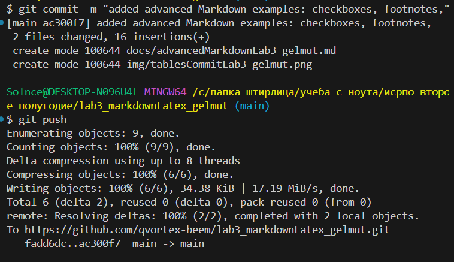

# третья лаба. markdown, latex

_эта работа показывает возможности markdown и latex_

### 1. содержание:

- [заголовки](docs/headersLab3_gelmut.md)
- [листы](docs/listsLab3_gelmut.md)
- [оформление](docs/formattingLab3_FIO.md)
- [латех](docs/latexLab3_gelmut.md)

### 2. лучшие цитаты дендрария эвкалиптовича

1. _о жизни_
   - > даже, когда денег нет можно ловить голубей
   - > вайб-кодеры, они все на питоне кодят, взять того же артура ...
2. _об учебе_
   - > ну подумаешь 10 баллов, ~~спишем~~ прорвемся
   - > да ладно, она не видит ничего, я ей включил белый экран и ~~рассказываю~~ сочиняю стою
3. _о программировании_ - `csharp
     01100010010010
 `
   | порядковый номер | человек | особое отличие |
   |-|-|-|
   |1|драник эклерович|говорят, что он белорус|
   |2|дабстеп эквалайзерович|любит классическую музыку|
   |3|дисперсий эквивалентович|питает особую любовь к математическому анализу|

- [x] добавить сноску[^сноска]
- [x] Выполнить лабораторную работу
- [ ] получить оценку

[^сноска]: а вот и сноска

[!WARNING] Внимание, это почти конец документа, готовьтесь

$S = \pi r^2$

$$
\sum_{i=1}^n \frac{10^i}{\sqrt[5i]{i!}}
\begin{pmatrix}
1 & 2\gamma \\
3 & 4
\end{pmatrix} , \gamma > 3
$$
